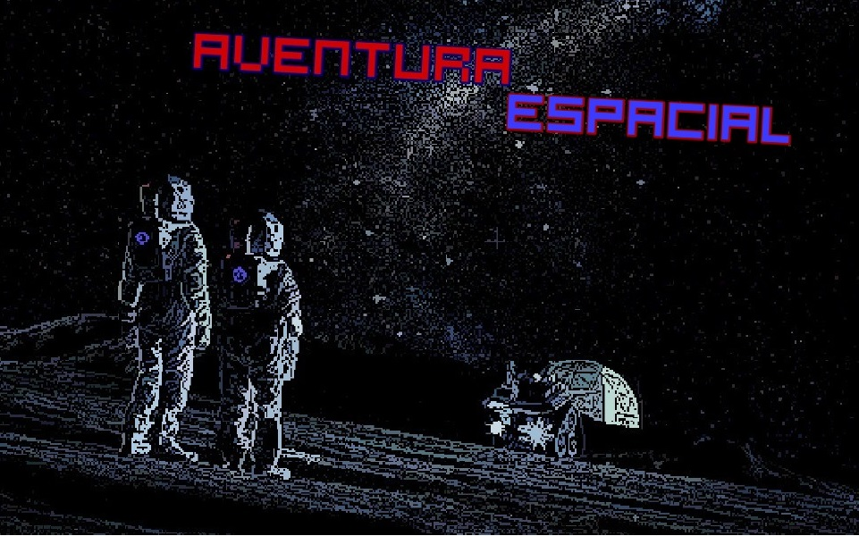

# aventura-espacial

## História
Uma tripulação estava voltando de uma missão espacial para a Terra, mas foi atingida por um meteoro e caíram no planeta Zakar. Agora eles precisam correr para pegar as peças da aeronave para voltar para a Terra.

Projeto de faculdade

Contribuidores:

- [Matthew2812](https://github.com/Matthew2812)
- [wandsu](https://github.com/wandsu)
- [JP-Colafati](https://github.com/JP-Colafati)
